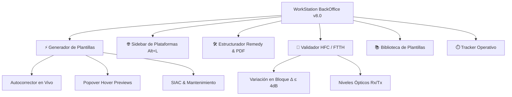

# 🚀 BackOffice WorkStation Suite — Versión 8.0

<div align="center">


**Plataforma Integral de Productividad, Diagnóstico Técnico en Tiempo Real y Generación Automatizada de Plantillas para BackOffice Telecom.**

[🌐 Probar en Vivo (GitHub Pages)](https://dreyeles.github.io/backoffice-workstation/) · [✨ Novedades v8.0](#-novedades-clave-de-la-versi%C3%B3n-80) · [📌 Módulos](#-m%C3%B3dulos-y-capacidades-principales) · [⌨️ Atajos de Teclado](#%EF%B8%8F-atajos-y-productividad)

</div>

---

## 🌟 Novedades Clave de la Versión 8.0

La versión **8.0** revoluciona la experiencia operativa con un ecosistema inteligente de asistencia en tiempo real, previsualizaciones flotantes, navegación lateral expandible y autocorrección contextual:

### 1. 👁️ Popover Flotante de Previsualización en Vivo (*Live Preview Glassmorphism*)
- **Inspección Previa Sin Clics:** Al posar el cursor sobre cualquier botón de descarte rápido (*Ciclo de llamada, Cliente conforme, Visita técnica, etc.*), aparece un popover flotante inteligente con diseño *glassmorphism* que muestra con precisión el texto exacto a insertar.
- **Cálculo Dinámico de Vista:** Ubicado en la raíz del DOM (`body`) con detección de bordes para evitar desbordamientos y asegurar un posicionamiento perfecto en cualquier resolución.

### 2. 🔤 Motor de Autocorrección Ortográfica y Abreviaturas Técnicas
- **Corrección en Tiempo Real:** Corrige automáticamente tildes, faltas ortográficas recurrentes y expande abreviaturas técnicas de telecomunicaciones mientras el asesor escribe.
- **Tipeo Fluido & Preservación de Cursor:** Algoritmo que respeta los espacios naturales, saltos de línea y la posición exacta del cursor en todo momento.
- **Soporte para Pegado (`Ctrl+V`) y Compilación:** Aplica la corrección integral de inmediato al pegar contenido externo o al generar las plantillas SIAC / Mantenimiento.

### 3. 🌐 Sidebar Retráctil de Enlaces & Plataformas Operativas (`Alt + L`)
- **Hub de Herramientas de Internet:** Menú lateral desplegable de rápido acceso con enlaces directos categorizados a las plataformas corporativas críticas (SGA, SIAC, Remedy, Hygeia, Speedtest, etc.).
- **Atajo Global:** Se activa o contrae instantáneamente mediante la combinación de teclas <kbd>Alt</kbd> + <kbd>L</kbd> o desde el botón del encabezado.

### 4. 📋 Estandarización de Formato Mantenimiento & SIAC
- **Alineación con Estándares Oficiales:** Formato homologado para las notas de campo de técnicos en Mantenimiento y categorización precisa en SIAC Único.
- **Formato Tipo Oración (*Sentence Case*):** Rediseño tipográfico en los chips de descartes en minúsculas con inicial mayúscula para una lectura más ergonómica y descansada.

### 5. 🛠️ Estructurador de Incidencias Remedy con Exportación PDF
- Soporte para pegado directo de evidencias y capturas con <kbd>Ctrl</kbd> + <kbd>V</kbd>.
- Generación de reportes listos para escalamiento y exportación en PDF con un solo clic.

---

## 📌 Módulos y Capacidades Principales



### 1. 📝 Generador Inteligente de Tipificaciones (SIAC / Manto)
* **Cascada Predictiva:** Selección de Motivo/Problema con categorización automática en SIAC Único y Mantenimiento.
* **Descartes Rápidos con Hover Preview:** Inserción de escenarios frecuentes con previsualización flotante.
* **Hashtags y Metadatos Dinámicos:** Clasificación ágil de incidencias para auditorías operativas.
* **Copiado al Portapapeles en 1-Clic:** Formato limpio y compatible con los gestores de tickets.

### 2. ⚡ Diagnóstico Técnico de Niveles (HFC & FTTH)
* **HFC (Coaxial):** Validación de *Upstream SNR*, *Downstream SNR*, *Potencia Rx*, *Potencia Tx* y **análisis de variación en bloque ($\Delta \le 4.0\text{ dB}$)** para detección preventiva de degradación de planta.
* **FTTH (Fibra Óptica):** Validación instantánea de niveles ópticos *Tx* y *Rx* con semáforo visual de tolerancias homologadas.

### 3. 🛠️ Estructurador de Escalamientos Remedy
* Generación de ficha técnica de escalamiento con datos estructurados (Falla, ID, DNI, Cliente, Detalle de Pruebas).
* Captura y renderizado de imágenes desde el portapapeles (`Ctrl+V`).
* Exportación a PDF para adjuntar a la orden de servicio.

### 4. 📡 Catálogo de Equipos y Credenciales
* Identificador rápido de Cablemódems, Routers y ONTs (ZTE, Technicolor, Huawei, Plume, Sagemcom, etc.).
* Guía de credenciales predeterminadas de acceso técnico y estado de homologación.

### 5. ⏱️ Tracker Operativo y Control de Turno
* Registro de casos gestionados en el turno con contador persistente en `localStorage`.
* Resumen de tiempos de atención y métricas diarias.

### 6. 🎨 Gestor de Plantillas Personalizadas
* Repositorio local de notas y snippets con editor incorporado y filtros de búsqueda.

---

## ⌨️ Atajos y Productividad

| Atajo | Acción |
| :--- | :--- |
| <kbd>Alt</kbd> + <kbd>L</kbd> | Abrir / Cerrar el Sidebar de Enlaces y Plataformas |
| <kbd>Ctrl</kbd> + <kbd>V</kbd> | Pegar capturas de pantalla directamente en el estructurador Remedy |
| <kbd>Hover</kbd> | Ver previsualización flotante (*Popover*) del texto de descartes rápidos |
| <kbd>Esc</kbd> | Cerrar cualquier ventana modal activa |

---

## 🛠️ Arquitectura y Tecnologías

* **Arquitectura:** Single Page Application (SPA) modular y ligera, 100% Client-Side.
* **Frontend:** HTML5 Semántico, CSS3 Moderno (Custom Properties, Flexbox, CSS Grid, Glassmorphism, Micro-animaciones) y Vanilla JavaScript (ES6+).
* **Persistencia:** Web Storage API (`localStorage`).
* **Seguridad & Privacidad:** Ejecución 100% local en el navegador, sin envío de datos sensibles de clientes a servidores externos.

---

## 🚀 Uso e Instalación

### Acceso Directo Web
Puedes utilizar la plataforma directamente desde GitHub Pages:
👉 **[https://dreyeles.github.io/backoffice-workstation/](https://dreyeles.github.io/backoffice-workstation/)**

### Uso Local / Despliegue Interno
1. Clona este repositorio:
   ```bash
   git clone https://github.com/Dreyeles/backoffice-workstation.git
   ```
2. Abre `index.html` en cualquier navegador web moderno (*Google Chrome, Microsoft Edge, Mozilla Firefox*). No requiere Node.js, servidores web ni instalación de paquetes.

---

## 👨‍💻 Autor y Mantenimiento

Diseñado y desarrollado por **Drey E. Aymituma** para la optimización de procesos operativos, reducción de TMO y excelencia en la atención técnica de BackOffice.
